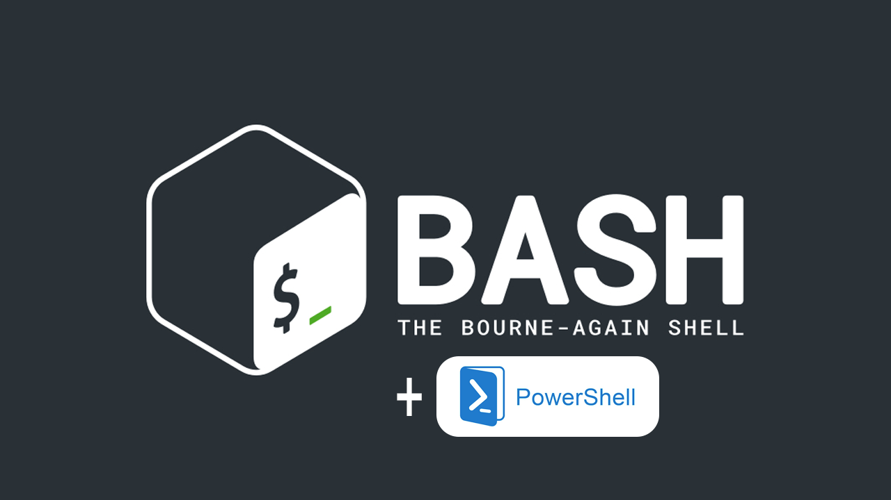

<h1 align="center">
    APL Practical Work [2025]
</h1>

<p align="center">
    <strong>Repository for the APL practical work of the Hardware Virtualization course</strong>
    <br>
    <strong>- <a href="https://www.unlam.edu.ar/">UNLaM</a> (National University of La Matanza) -</strong>
</p>

<p align="center">
    <a href="#summary">Summary</a> •
    <a href="#application-structure">Application structure</a>
    <br>
    <a href="#development-team">Development team</a> •
    <a href="#additional-material">Additional material</a> •
    <a href="#license">License</a> •
    <a href="#acknowledgments">Acknowledgments</a>
</p>

<p align="center">
    
</p>

<p align="center">
    <a href="./docs/translations/es/README.md">(spanish version)</a>
</p>

## Summary

This repository contains the APL practical work for the Hardware Virtualization course at the [National University of La Matanza (UNLaM)](https://www.unlam.edu.ar/). This practical work consists of developing a series of five scripts in [Bash](https://www.gnu.org/software/bash/) and [PowerShell](https://learn.microsoft.com/en-us/powershell/), learning how to create scripts to automate tasks.

### Scripts

|  #  | Topic                                         |                                 |                                             |
| :-: | :-------------------------------------------- | :-----------------------------: | :-----------------------------------------: |
|  1  | Customer satisfaction survey results analysis | [Bash](./src/bash/exercise-01/) | [PowerShell](./src/powerShell/exercise-01/) |
|  2  | Route analysis in a transport map             | [Bash](./src/bash/exercise-02/) | [PowerShell](./src/powerShell/exercise-02/) |
|  3  | Event counting in system logs                 | [Bash](./src/bash/exercise-03/) | [PowerShell](./src/powerShell/exercise-03/) |
|  4  | Code security analysis in Git repositories    | [Bash](./src/bash/exercise-04/) | [PowerShell](./src/powerShell/exercise-04/) |
|  5  | Country information search tool               | [Bash](./src/bash/exercise-05/) | [PowerShell](./src/powerShell/exercise-05/) |

> [!TIP]
> If you want to see the exercise instructions check out the `README.md` file within the desired exercise folder.

## Application structure

```plaintext
APL-Practical-Work-2025/
│
├── docs/
│   ├── assets/ (...)
│   │
│   └── translations/
│       ├── en/ (...)
│       └── es/ (...)
│
├── src/
│   ├── bash/
│   │   ├── exercise-01/ (...)
│   │   ├── exercise-02/ (...)
│   │   ├── exercise-03/ (...)
│   │   ├── exercise-04/ (...)
│   │   └── exercise-05/ (...)
│   │
│   └── powerShell/
│       ├── exercise-01/ (...)
│       ├── exercise-02/ (...)
│       ├── exercise-03/ (...)
│       ├── exercise-04/ (...)
│       └── exercise-05/ (...)
│
├── .gitignore
├── LICENSE
└── README.md
```

-   [docs](./docs) - Files related to the documentation.

    -   [assets](./docs/assets) - Editable documents, images, PDFs, etc.
    -   [translations](./docs/translations) - Translations of `.md` (Markdown) files.

-   [src](./src) - Script files

    -   [bash](./src/bash) - Bash scripts.
    -   [powerShell](./src/powerShell) - PowerShell scripts.

-   [.gitignore](./.gitignore) - Git configuration file to avoid tracking unwanted files.
-   [LICENSE](./LICENSE) - Repository license.
-   [README.md](./README.md) - Markdown file with the general documentation of the repository.

## Development team

-   [Choque Luis](https://github.com/LuisAChoque)
-   [Farias Maira Soledad](https://github.com/maifarias)
-   [Hoz Lucas](https://github.com/hozlucas28)
-   [Massa Valentin](https://github.com/ValentinMassa)
-   [Rodriguez Gonzalo Leonel](https://github.com/grodriguezAR)

## Additional material

-   [Practical work requirements](./docs/translations/en/requirements.md)

## License

This repository is under the [MIT license](./LICENSE). For more information about what is permitted with the contents of this repository, visit [choosealicense.com](https://choosealicense.com/licenses/).

## Acknowledgments

We would like to thank the teachers from the [UNLaM](https://www.unlam.edu.ar/) Hardware Virtualization course for their support and guidance.
